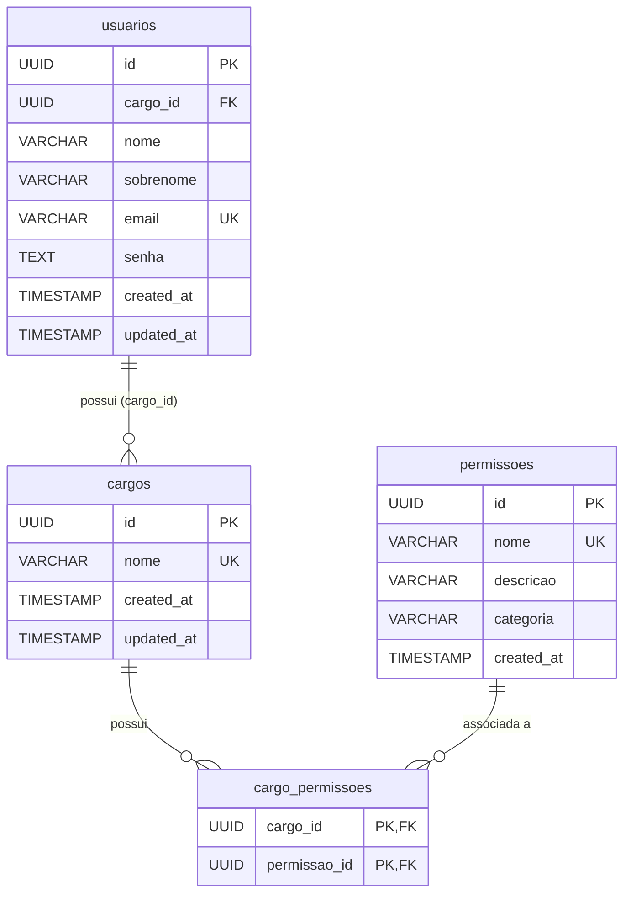

# Design Document: Refatoração do Sistema de Cargos e Permissões (RBAC Dinâmico)

## 1. Visão Geral

Este documento especifica a refatoração do sistema de controle de acesso baseado em funções (RBAC - *Role-Based Access Control*) do projeto **gPatri**, com foco no microsserviço `ms-usuarios`.

### 1.1 Contexto e Motivação
Anteriormente, o sistema utilizava um enum fixo em Java (`PermissaoEnum`) e atribuições estáticas de permissões em código. A criação ou ajuste de cargos e a incorporação de novas funcionalidades exigiam alterações de código-fonte e recompilação.

### 1.2 Objetivos
- Tornar o sistema de cargos escalável e dinâmico em tempo de execução.
- Permitir que um usuário com permissão de administrador gerencie Cargos (criação, edição de permissões vinculadas, exclusão e listagem).
- Transformar as Permissões em um catálogo de capacidades do sistema persistido no banco de dados.
- Fornecer endpoints de consulta para que o painel administrativo descubra todas as permissões disponíveis no sistema.
- Manter o padrão de autenticação **Stateless** via JWT, preservando total compatibilidade com os demais microsserviços (`ms-patrimonio`, `ms-gateway`).

---

## 2. Arquitetura e Modelagem de Dados

### 2.1 Diagrama Entidade-Relacionamento



### 2.2 Estrutura das Tabelas

1. **`permissoes`**:
   - `id` (UUID, PK)
   - `nome` (VARCHAR(100), UNIQUE, NOT NULL) — Ex: `"USUARIO_CADASTRAR"`, `"PATRIMONIO_LISTAR"`, `"PERMISSAO_LISTAR"`.
   - `descricao` (VARCHAR(255)) — Descrição amigável da permissão.
   - `categoria` (VARCHAR(100)) — Agrupamento funcional (ex: `"USUARIOS"`, `"CARGOS"`, `"PATRIMONIO"`, `"EMPRESTIMOS"`).
   - `created_at` (TIMESTAMP WITH TIME ZONE, DEFAULT CURRENT_TIMESTAMP)

2. **`cargos`**:
   - `id` (UUID, PK)
   - `nome` (VARCHAR(100), UNIQUE, NOT NULL) — Ex: `"Administrador"`, `"Almoxarife"`, `"Auditor"`.
   - `created_at` (TIMESTAMP WITH TIME ZONE, DEFAULT CURRENT_TIMESTAMP)
   - `updated_at` (TIMESTAMP WITH TIME ZONE, DEFAULT CURRENT_TIMESTAMP)

3. **`cargo_permissoes`**:
   - `cargo_id` (UUID, FK -> `cargos(id)` ON DELETE CASCADE)
   - `permissao_id` (UUID, FK -> `permissoes(id)` ON DELETE CASCADE)
   - `PRIMARY KEY (cargo_id, permissao_id)`

4. **`usuarios`**:
   - Mantém relação N:1 com `cargos(id)`.

### 2.3 Migração Flyway (`V2__criar_tabela_permissoes_e_refatorar_rbac.sql`)
1. Cria a tabela `permissoes`.
2. Insere todas as permissões existentes no sistema (25 permissões legadas + `PERMISSAO_LISTAR`).
3. Converte os registros da tabela `cargo_permissoes` legada (que guardava texto) para a nova chave composta referenciando `permissoes(id)` e `cargos(id)`.
4. Garante a integridade referencial sem perda de dados para ambientes existentes.

---

## 3. Especificação de Componentes e APIs

### 3.1 Entidades JPA (`ms-usuarios`)

- **`Permissao`**: Entidade mapeada para a tabela `permissoes`.
- **`Cargo`**: Atualizada com `@ManyToMany(fetch = FetchType.EAGER)` apontando para `Permissao` via tabela de junção `cargo_permissoes`.
- **`Usuario`**: Atualizado o método `getAuthorities()` para mapear dinamicamente os nomes das permissões da entidade (`Permissao.getNome()`) para instâncias de `SimpleGrantedAuthority`.

### 3.2 DTOs e Contratos

- **`PermissaoResponseDTO`**:
  ```json
  {
    "id": "3fa85f64-5717-4562-b3fc-2c963f66afa6",
    "nome": "PATRIMONIO_CADASTRAR",
    "descricao": "Permite cadastrar novos itens e patrimônios no acervo",
    "categoria": "PATRIMONIO"
  }
  ```

- **`CargoRequestDTO`**:
  ```json
  {
    "nome": "Auditor Interno",
    "permissoesIds": [
      "3fa85f64-5717-4562-b3fc-2c963f66afa6",
      "7ca85f64-5717-4562-b3fc-2c963f66af11"
    ]
  }
  ```

- **`CargoResponseDTO`**:
  ```json
  {
    "id": "8ca85f64-5717-4562-b3fc-2c963f66af22",
    "nome": "Auditor Interno",
    "permissoes": [
      {
        "id": "3fa85f64-5717-4562-b3fc-2c963f66afa6",
        "nome": "PATRIMONIO_CADASTRAR",
        "descricao": "Permite cadastrar novos itens e patrimônios no acervo",
        "categoria": "PATRIMONIO"
      }
    ]
  }
  ```

### 3.3 Endpoints REST

#### Módulo de Permissões (`/api/v1/permissoes`)
| Método | Endpoint | Permissão Exigida | Descrição |
|---|---|---|---|
| `GET` | `/api/v1/permissoes` | `PERMISSAO_LISTAR` | Retorna catálogo de todas as permissões cadastradas no sistema |
| `GET` | `/api/v1/permissoes/{id}` | `PERMISSAO_LISTAR` | Detalha uma permissão específica por ID |

#### Módulo de Cargos (`/api/v1/cargos`)
| Método | Endpoint | Permissão Exigida | Descrição |
|---|---|---|---|
| `POST` | `/api/v1/cargos` | `CARGO_CADASTRAR` | Cria um novo cargo associado aos IDs de permissões informados |
| `GET` | `/api/v1/cargos` | `CARGO_LISTAR` | Lista todos os cargos e suas respectivas permissões |
| `GET` | `/api/v1/cargos/{id}` | `CARGO_LISTAR` | Busca cargo por ID com detalhes de permissões |
| `PATCH` | `/api/v1/cargos/{id}` | `CARGO_EDITAR` | Atualiza nome e conjunto de permissões do cargo |
| `DELETE` | `/api/v1/cargos/{id}` | `CARGO_EXCLUIR` | Remove um cargo (bloqueado se houver usuários associados) |

---

## 4. Segurança e Emissão de JWT

1. **Geração do Token (`JwtTokenProvider`)**:
   - Ao realizar login, o usuário tem suas autoridades extraídas dinamicamente a partir do seu `Cargo` e sua lista de entidades `Permissao`.
   - A claim `permissoes` continua sendo populada como uma string delimitada por vírgula (`"USUARIO_LISTAR,CARGO_CADASTRAR,PERMISSAO_LISTAR,..."`).
2. **Validação nos Demais Microsserviços**:
   - `ms-patrimonio` e `ms-gateway` continuam utilizando seus filtros de autenticação JWT existentes sem necessidade de refatoração, garantindo **zero breaking changes** nos outros módulos da aplicação.

---

## 5. Carga Inicial (`InitialSetupConfig`)

No startup da aplicação (`CommandLineRunner`):
1. **Catálogo de Permissões**: Garante a persistência de todas as permissões do sistema caso a tabela esteja vazia ou haja novas permissões.
2. **Cargo Administrador**: Cria o cargo `"Administrador"` atribuindo todas as permissões do catálogo.
3. **Cargo Usuário**: Cria o cargo `"Usuário"` com as permissões operacionais padrão.
4. **Usuário Administrador Inicial**: Cria o usuário `admin@admin.com` vinculado ao cargo `"Administrador"` se não existir.

---

## 6. Estratégia de Testes

1. **Testes Unitários**:
   - `PermissaoServiceTest`: Busca de permissões, tratamento de recurso não encontrado.
   - `CargoServiceTest`: Criação e edição com validação de IDs inexistentes (`BadRequestException`), conflito de nomes (`ConflictException`), exclusão segura.
   - `AuthServiceTest` / `JwtTokenProviderTest`: Emissão e validação de token com autoridades dinâmicas.
2. **Testes de Integração (MockMvc)**:
   - `PermissaoControllerTest`: Autorização via `@WithMockUser`, verificação de status `200` e `403`.
   - `CargoControllerTest`: CRUD completo de cargos com validações de payload e regras de autorização.
